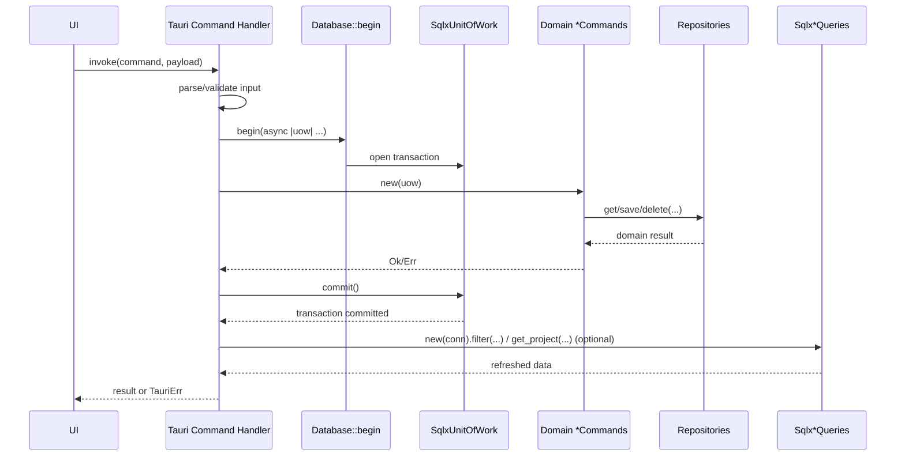
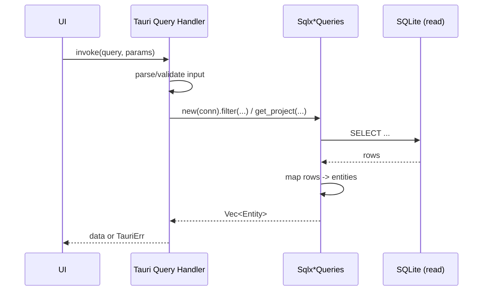

# Use Case Flow

This document describes the generic flow used by the application for **commands** (state changes) and **queries** (read operations).

## Generic command algorithm

Applicable to handlers such as `add_card`, `delete_card`, `update_card`, `add_project`, and `add_section`.

1. UI invokes a Tauri command.
2. Tauri handler validates/parses inputs.
3. Handler calls `db.begin(...)`.
4. Database opens a transaction and creates a `SqlxUnitOfWork`.
5. Domain command service (`*Commands`) executes business logic using repositories from the unit of work.
6. Unit of work commits the transaction.
7. Handler optionally executes a follow-up query adapter to return fresh state.
8. Result is returned to UI (or error mapped to `TauriErr`).

## Generic query algorithm

Applicable to handlers such as `filter_cards`, `get_project`, `filter_projects`, and `filter_sections`.

1. UI invokes a Tauri query command.
2. Tauri handler validates/parses inputs.
3. Handler constructs query adapter with shared DB connection.
4. Query adapter executes SQL read operation(s).
5. Rows are mapped to domain entities.
6. Data is returned to UI (or error mapped to `TauriErr`).

